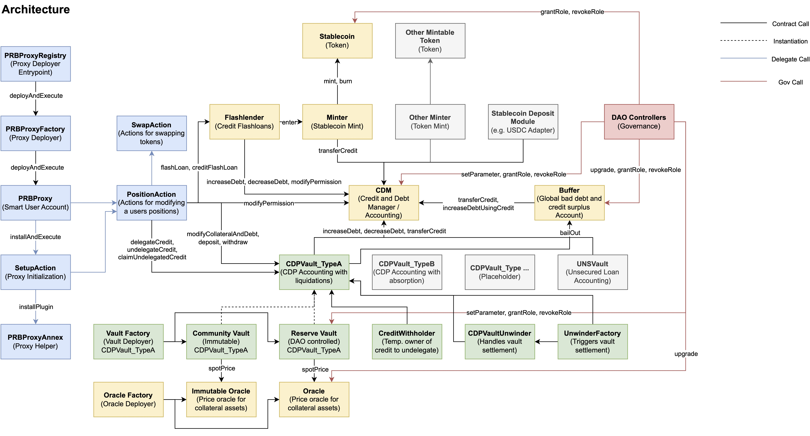
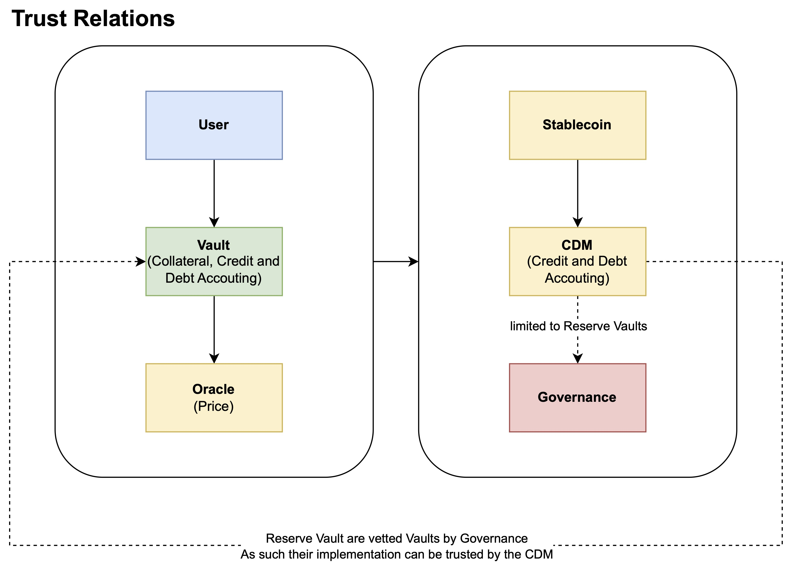

# Documentation
This is a technical documentation of the protocol's smart contract architecture. Higher level information on the protocol's mechanisms and succinct mathematical definitions can be found in the [whitepaper](./Ecru-Whitepaper.pdf).

## Contents
- [Overview](#overview)
- [CDM](#cdm)
- [CDPVault](#cdpvault)
- [User Interaction](#user-interaction-proxy-actions)
- [Instantiations](#instantiations)

## Overview

## CDM
### Overview
At the core of the protocol is the `CDM` (Credit and Debt Manager) which tracks credit and debt throughout the system. Each `Account` in the `CDM` has an associated `balance` and `debtCeiling`. A positive `balance` indicates that an `Account` has credit, whereas a negative `balance` indicates that an account has outstanding debt. Each `Account` can mint credit (to another `Account`) by taking on debt - up to its `debtCeiling`. Debt can be repaid by transferring an equal amount of credit to the `Account` for which to settle the debt for. It is possible for one `Account` to transfer existing credit to another account - even when the `debtCeiling` or the `globalDebtCeiling` is exceeded. In practice, `Account` management is used to track credit balances for users (e.g. EOAs) as well as the credit and debt balances of CDPVault, the Buffer, and the Flashlender contracts.

### Collateralization
The `CDM` does not assess if the debt of an `Account` is backed by collateral or not. It does not differentiate between backed or unbacked debt. It is up to the party which sets the `debtCeiling` for a given `Account`. Practically speaking, a `CDPVault` (see below) may be able to obtain a non-zero `debtCeiling` since they implement mechanisms that enforce collateral requirements.

### Permissions
An `Account` can delegate the right to transfer and mint credit to another address by calling `modifyPermission`. Additionally an account can also set a permission agent which is able to modify permissions on behalf of the account by calling `setPermissionAgent`.

## CDPVault
### Overview
One type of `Account` mentioned above is the `CDPVault`. The `CDPVault` is the first vault type supported by the protocol, though many other vault types can be added in the future (e.g. vaults capable of unsecured lending). The `CDPVault` allows users to borrow credit (take on debt) by creating collateralized-debt-positions which a user has to collateralize beforehand. The collateral vs. debt value (in USD) has to meet the collateralization requirements - otherwise the collateral of a `Position` can be liquidated permissionlessly.

### Credit Delegation
An `Account` (in the `CDM`) with a positive `balance` (credit) can delegate (i.e. lend) their credit to a `CDPVault` by calling `delegateCredit` which attributes a proportional amount of `share`'s to the user. In doing so, they receive interest from the borrowers in exchange for being liable to cover losses (e.g. bad debt from the failed liquidation of an undercollateralized `Position`). Undelegating (withdrawing) credit from the `CDPVault` is a two step process to avoid bank-runs / race-conditions if there's an anticipated bad credit event incoming, instead fairly distributing losses amongst all credit delegators:
1. The user signals undelegation by calling `undelegateCredit` which locks the `share` amount to redeem for credit.
2. After a certain `epoch` epoch count has accrued the actual amount of credit the user is able to redeem for their `share` count is determined by factoring any losses that have accrued since step one. The user is able to call `claimUndelegatedCredit` which burns the `share` count signaled for undelegation in step one. If there's not enough liquid credit available (due to high utilization) then the `share` amount signaled in step one is decreased automatically in proportion to the withdrawal credit amount.

### Position Management

#### Overview
Each vault allows a user to create a `Position` which is comprised of the current absolute amounts (units) of collateral and normalized debt (i.e. the gross amount of borrowed `Credit`, not factoring in the accrued due interest).

#### Permissions
The owner of a `Position` can delegate the right to modify the collateral or normalized debt balances for adjusting collateral-to-debt ratios of a `Position`, withdrawing collateral, or transferring more `Credit` to another account by calling `modifyPermission`. Additionally, the owner of a `Position` can also set a permission agent which is able to modify permissions for the `Position` on behalf of the owner by calling `setPermissionAgent`.

#### Cash Balances
In order to use an asset as collateral in a `Position` the user needs to first call `deposit` which transfers the tokens into the `CDPVault` and attributes the deposited amount as a `Cash` balance to the user. After that the user can call `modifyCollateralAndDebt` to attribute the `Cash` to the collateral balance of the `Position`. In order to withdraw collateral from a `Position` the user needs to first call `modifyCollateralAndDebt` to decrease the collateral balance of the `Position` (note the collateralization requirements). After that the user is attributed with a `Cash` balance which he can withdraw by calling `withdraw`.

#### Adjusting Collateral and Debt of a Position
The method `modifyCollateralAndDebt` allows for adjusting collateral and normalized debt balances of a `Position`. A `Position` is uniquely identified by the address of its creator (or owner).  A positive `deltaCollateral` amount will increase the collateral balance of a `Position` by sourcing the `Cash` from the `collateralizer`, a negative amount will decrease the collateral balance by withdrawing the collateral to the `collateralizer`. A positive `deltaNormalDebt` balance will increase the debt of a `Position` and attribute the corresponding amount of `Credit` to the `creditor`, a negative amount will repay the debt of a `Position` by sourcing the corresponding amount of `Credit` from the `creditor`. At any point in time a `Position` the outstanding debt of a position has to either be 0 or greater than the `debtFloor`. This mitigates the accrual of 'dust' due to transaction fees for settling debt being higher than the remaining debt in a `Position`.

### Pricing (*Oracle)
`CDPVault` supports any oracle / relayer contract that implements the `IOracle` interface. The repo contains various upgradable implementations:
- `ChainlinkOracle`: validates and forwards a price for one asset from Chainlink
- `Chainlink3PoolOracle`: validates and forward a composite price for a Curve 3Pool using Chainlink feeds

### Interest Rates (From Normalized Debt to Debt)
Interest accrues on a per second basis and is tracked for each `Position` individually (`PositionIRS`) since each `Position` can opt into the [Exchange](#exchange-credit-redemptions) which reduces its interest rate (`accruedRebate`). Additionally, a shared global state (`GlobalIRS`) is tracked as well which is needed for determining the total outstanding debt in constant runtime. 

#### Rate Accumulator
Since the interest accrues (updates) continuously it does not make much sense to store the accrued interest or the net debt explicitly. Instead, a globally tracked 'exchange rate' for converting from a normalized debt amount (excludes interest) and an actual debt amount is used (`rateAccumulator`). The `rateAccumulator` is a continuously increasing rate which is [derived](../src/InterestRateModel.sol#121) from the `baseRate` (per second rate). The due interest (without any rebates) is simply the change (delta) of the debt amount when first borrowing credit and when repaying the borrowed credit.

#### Rebates
Opting into the Exchange feature allows borrowers to reduce their interest rates (see [Exchange](#exchange-credit-redemptions) for more information) according to the `rebateFactor` which defines the size of the rebate. Rebates accrue over time and are stored explicitly in `PositionIRS` (`accruedRebate`). Every time the debt of a `Position` is repaid the model will calculate the rebate claim (`claimedRebate`, how much rebate can be 'realized' for a given repay amount) which is proportional to the repay amount and which is deducted from the repay amount (and from `accruedRebate`), resulting in the borrower having to repay less credit for the outstanding normalized debt.

#### Calculating Due Interest
To get from the normalized debt amount of a `Position` to the actual debt which includes the due interest that has accrued the following formula can be used:
`debt = (normalDebt * rateAccumulator / wad) - accruedRebate`. `rateAccumulator` and `accruedRebate` can be obtained by calling `virtualIRS` by using the address of the creator of the `Position`.

#### Models
A `CDPVault` can be instantiated with a static interest rate model where the interest rate is set by an authorized account or with a utilization-based interest rate model where it is derived from how much of the vault's credit line has been lent out.

#### Static Model
An authorized account is able to set `baseRate` (expressed as a per second rate) via `setParameter` between `0` and  `1.0` wad.

#### Utilization-Based Model
If `baseRate` is set to  `-1` (by passing `type(uint256).max` to `setParameter`) either at deployment or after deployment then the `CDPVault` uses the utilization-based interest rate model. Deriving the interest rate involves additional steps: At deployment of the `CDPVault` a `targetUtilizationRatio`is defined which expresses how much of the available credit should be lent out and how much should sit idle, a `maxUtilizationRatio` is defined which expresses how much of the available credit should at a maximum be lent out - this ensures that delegators (or lenders) always have the ability to eventually withdraw their credit again. Additionally a minimum, maximum, and a target interest rate defines the relation (curve) between the utilization of credit and the resulting interest rate the borrowers have to pay.

### Liquidation (CDPVault_TypeA)
If a `Position` becomes undercollateralized (`collateral * spotPrice / liquidationRatio < debt`) anyone is able to call `liquidatePositions` to buy as much collateral in exchange for a proportional amount of credit as is necessary to make the `Position` safe again. `liquidatePositions` allows for batch liquidations of more than one `Position`. The liquidator specifies the `owners` of the unsafe `Positions` to liquidate and a `repayAmount` for each one of them.

#### Liquidation Discount
The collateral can be bought at a discount (`liquidationDiscount`) from the current `spotPrice` to incentivize liquidators to trigger timely liquidation of an unsafe `Position`.

#### Liquidation Penalty
In order to prevent self-liquidations a `liquidationPenalty` is applied to the the `repayAmount` which slightly reduces the amount of debt that is settled with the `repayAmount`.

#### Adjusted Repay Amount
If a `Position` does not have enough collateral to sell to make it safe again, then the entire `Position` is liquidated. This will limit (reduce) the `repayAmount` by the available collateral value (according to the discounted spot price). The remaining debt is marked as a loss (bad debt), the `CDPVault` will call into the `Buffer` to request a bail out. The bail out might not be given, or only partially given, to the `CDPVault`. The remaining bad debt is attributed to the credit delegators.

To avoid violating the `debtFloor` (debt is non-zero or lower than `debtFloor`) during partial liquidation, we only liquidate such that at least `debtFloor` amount of debt remains in the `Position`.

### Exchange (Credit Redemptions)
As an additional peg-stability mechanism the `CDPVault` allows for the creation of limit orders against each `Position` which permits anyone to redeem credit for collateral. Borrowers are incentivized to create limit orders at a lower price ticks to obtain greater rebates on their due interest.

#### Price Ticks
Price ticks define relative price premiums from the current `spotPrice` and can be set by an authorized account by calling `addLimitPriceTick` or `removeLimitPriceTick`. They are stored in a linked list sorted from the lowest tick starting at `1.0` wad to the highest tick.

#### Rebate Factor
Price ticks define the `rebateFactor` (see [rebates](#rebates)). The closer the `priceTick` is to 1.0 the higher the `rebateFactor`. The method `calculateRebateFactorForPriceTick` can be used to calculate the resulting `rebateFactor` for a given `priceTick`.

#### Limit Orders
Borrowers can create limit orders by calling `createLimitOrder` with an active `priceTick` or remove their limit order on their `Position` by calling `cancelLimitOrder`. Limit orders created for a given `priceTick` are stored in a linked list as well as being sorted by oldest to newest. The outstanding debt of their `Position` has to be above `limitOrderFloor`. If the `limitOrderFloor` is not met anymore (due to not borrowing enough credit, repaying debt, a partial limit order execution, or a liquidation) the corresponding limit order is automatically closed stops accruing any new rebates from that point on.

#### Execution
Limit orders are executed starting from the lowest price tick and within a price tick by FIFO (first in, first out) meaning that older limit orders are executed first for a given price tick. For redeeming credit (buying collateral), the taker calls `exchange` with the `upperLimitPriceTick` (highest price tick at which they like to swap credit) and `creditToExchange`, the amount of credit to swap for collateral. If the execution is not able to swap exactly `creditToExchange` then it will revert.

### Emergency Mode (CDPVaultUnwinder)
In addition to verifying that each `Position` is sufficiently collateralized the vault will also meter the current global collateralization. If the ratio is not meeting `globalLiquidationRatio` because of an unexpectedly high price fall the `CDPVault` can be transitioned into emergency mode by calling `enterEmergencyMode`. This pauses the every interaction with the contract. If the `CDPVault` is not unpaused by an authorized account within 2 weeks a `CDPVaultUnwinder` contract can be deployed which will settle claims between borrowers and delegators (lenders).

#### Unwinding
After the timeout has passed (2 weeks after the `CDPVault` was initially paused) anyone can deploy a `CDPVaultUnwinder` via the `CDPVaultUnwinderFactory`. This will transfer all the liquid credit and the collateral assets from the `CDPVault` to the `CDPVaultUnwinder`. Then the following sequence of steps is initiated:

1. `rateAccumulator`, `totalDebt`, `totalShares` are fixed at deployment to ensure a fair distribution of assets and liabilities between all stakeholders
2. borrowers can close their `Position`'s for the next 2 weeks (`createdAt + AUCTION_START`) via `redeemCredit` by repaying their debt and claim collateral according to the following formula: `repaidDebt / totalDebt * totalCollateral`
3. anyone can buy the remaining collateral which hasn't been redeemed by the borrowers in step 1. (after `AUCTION_START` has passed) by participating in a dutch auction where the price of the collateral slowly decreases over time. This phase will be run for 2 weeks (`createdAt + AUCTION_START + AUCTION_END`).
4. credit delegators (lenders) can redeem their shares for credit which has been collected in the phases before according to the formula: `redeemedShares * fixedCredit / fixedTotalShares`.

## User Interaction (Proxy Actions)
### Overview
In order to make interaction with the protocol easier a user may deploy a proxy contract (`PRBProxy`) to make use of the proxy actions which bundle various calls into one and support complex interactions that may involve external protocols.

### Actions
The current set of action contract have been implemented:
- `SetupAction`: Used when deploying a new proxy. It enables bundling the proxy setup with another action call.
- `SwapAction`: Integrates common DEX's such as UniswapV3 and 1Inch.
- `PositionAction`: Bundles multiple calls to `CDPVault` into one and makes use of the `SwapAction` to allow for deposits and exits with any token supported by DEX's. There are various specialized versions of the `PositionAction`:
  - `PositionAction20`: supports plain ERC20 tokens
  - `PositionAction4626`: supports wrapping and unwrapping ERC4626 tokens
  - `PositionActionChai`: supports wrapping and unwrapping of CHAI (tokenized DSR)
  - `PositionActionYV`: supports wrapping and unwrapping of yvTokens (Yearn)

## Instantiations
The protocol is not constrained to one way of deploying it - instead it can be instantiated for different use cases and with different manifestations of trust throughout the system.

### Semi-Permissionless CDP Stablecoin
The protocol can be configured as a CDP-based stablecoin with semi-permissionless onboarding of new collateral types. The `CDM` may entitle certain `CDPVault`'s to generate new debt - effectively given them the right to mint new `Stablecoin`'s. Other `CDPVault`'s may not be entitled to do so and rely on credit being delegated to them. The diagram below shows how the trust relations could be defined. Governance may not be needed if the set of entitled `CDPVault`'s is set once and should stay immutable.

  

### Single Asset Borrow Market
In addition the protocol can also be instantiated without its own `Stablecoin`. The `Minter` contract can be replaced with a contract which allows others (lenders) to deposit an existing stablecoin such as USDC, which converts it to internal credit, which then can be delegated to different `CDPVault`'s in exchange for interest. This instantiation may not need any form of governance either because no `CDPVault` would be entitled to draw new credit (<> debt) in the `CDM` - only the contract which manages the stablecoin (e.g. USDC) would be allowed to do so.
